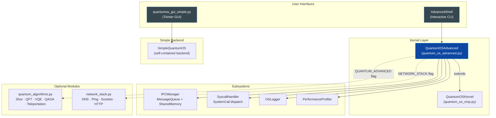
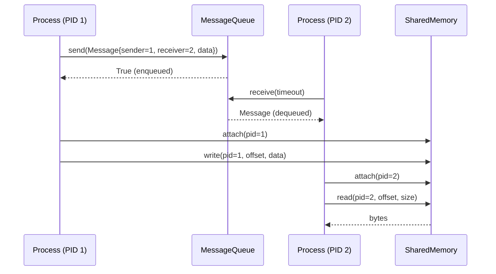
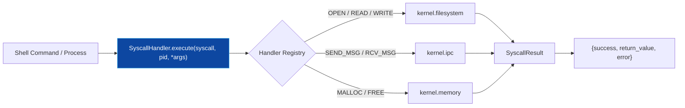

# ⚛ QuantumOS


QuantumOS is a Python-based **simulated operating system environment** that unifies classical OS concepts — process management, memory, virtual filesystems, system calls, and inter-process communication — with **quantum algorithm simulations** (Shor's factorization, Quantum Fourier Transform, VQE, QAOA, quantum teleportation) and a **simulated TCP/IP network stack**. The system is exposed through both a **Tkinter desktop GUI** and an **interactive advanced shell**.

---

## ✨ Features

- **🖥️ Desktop GUI** — A self-contained Tkinter application (`quantumos_gui_simple.py`) with five functional tabs: Dashboard, Quantum, Network, Files, and Monitor.
- **⚛ Quantum Algorithms** — Shor's factorization, Quantum Fourier Transform (QFT), VQE, QAOA, and quantum teleportation via the pluggable `quantum_algorithms` module.
- **🌐 Network Stack** — Simulated DNS resolution, ping, sockets, and an HTTP server via the pluggable `network_stack` module.
- **📨 Inter-Process Communication** — Bounded message queues and shared memory segments with PID-based attach/detach authorization.
- **🔧 System Call Interface** — A dispatch-based `SyscallHandler` supporting `open`, `read`, `write`, `send_msg`, `rcv_msg`, `malloc`, `free`, and more.
- **📋 Logging Subsystem** — Timestamped, component-tagged OS logging bridged to Python's `logging` module.
- **📈 Performance Profiler** — Records CPU/memory samples and computes uptime and average usage statistics.
- **🛡️ Graceful Degradation** — Optional subsystems are wrapped in feature flags (`QUANTUM_ADVANCED`, `NETWORK_STACK`), so the kernel runs even when optional modules are absent.
- **🐳 Containerized** — Ships with a `Dockerfile` and `docker-compose.yml` for reproducible deployment.

---

## 🏗️ Architecture

QuantumOS is organized into layered subsystems. The advanced kernel extends the base kernel and wires together IPC, syscalls, logging, profiling, networking, and quantum processing.



### Component Breakdown

#### 1. Kernel Layer (`quantum_os_mvp.py`, `quantum_os_advanced.py`)
- **`QuantumOSKernel`** (base): provides the process table, memory manager, virtual filesystem, and base shell commands.
- **`QuantumOSAdvanced`** (extends the base kernel): initializes the IPC manager, syscall handler, logger, and profiler; conditionally attaches the network stack and advanced quantum algorithms; boots the system, records initial memory metrics, and launches the `AdvancedShell`.

#### 2. Inter-Process Communication (IPC)
- **`Message`** — a dataclass carrying `sender_pid`, `receiver_pid`, payload, and timestamp.
- **`MessageQueue`** — a bounded, thread-safe queue (`queue.Queue`) for passing messages between PIDs.
- **`SharedMemory`** — a byte-array segment guarded by a lock. Processes must `attach(pid)` before reading or writing; access is authorized via the `allowed_pids` set.
- **`IPCManager`** — factory and registry for per-PID message queues and shared memory segments (auto-incrementing `shm_id`).



#### 3. System Call Interface
The `SystemCall` enum defines call types (`OPEN`, `READ`, `WRITE`, `FORK`, `SEND_MSG`, `RCV_MSG`, `MALLOC`, `FREE`, `SOCKET`, …). `SyscallHandler.execute()` dispatches to registered handlers and returns a `SyscallResult(success, return_value, error)`:



#### 4. Quantum Subsystem (`quantum_algorithms.py`, optional)
Exposes `ShorsAlgorithm.factor(n)`, `QuantumFourierTransform.qft()`, `VQE`, `QAOA`, `QuantumTeleportation`, and an `AdvancedCircuit` state-vector model. Loaded behind the `QUANTUM_ADVANCED` feature flag; if the import fails, the kernel continues without it.

#### 5. Network Subsystem (`network_stack.py`, optional)
Provides `NetworkStack` with `DNS.query()`, `ping()`, sockets, and `HTTPServer`. Loaded behind the `NETWORK_STACK` feature flag.

#### 6. GUI (`quantumos_gui_simple.py`)
A fully self-contained Tkinter application backed by `SimpleQuantumOS`, an in-memory backend with no external dependencies:

| Tab | Functionality |
|---|---|
| 📊 **Dashboard** | System info plus live uptime, process count, and memory stats (1-second refresh loop via `after(1000, ...)`) |
| ⚛ **Quantum** | Number factorization with step-by-step console output |
| 🌐 **Network** | DNS lookup and ping tools against the simulated network |
| 📁 **Files** | Virtual filesystem browser (`/`, `/home`, `/etc`) |
| 📈 **Monitor** | Canvas-rendered memory usage bar and live process table |

#### 7. Advanced Shell Commands
`uname`, `netstat`, `ping <ip>`, `nslookup <host>`, `factor <n>`, `qft <qubits>`, `logs [n]`, `profile`, `ipc`, plus all base kernel commands.

#### 8. Component Tests (`test_components.py`)
A sequential verification script that checks Tkinter window creation, NumPy quantum-state math, the quantum algorithms module, the network stack, and kernel initialization/command execution.

---

## 🛠️ Prerequisites

- **Python 3.10+**
- **Tkinter** (bundled with most Python distributions) — required for the GUI; a display server is needed since Tkinter cannot render in a headless environment without X11 forwarding
- **NumPy** (optional) — used for quantum state-vector mathematics
- **Docker** (optional) — for containerized execution

---

## 📦 Installation

```bash
# Clone the repository
git clone https://github.com/Shivay00001/quantum_os.git
cd quantum_os

# Install dependencies
pip install -r requirements.txt
```

---

## 💻 Usage

**Run the GUI (requires a desktop environment):**
```bash
python quantumos_gui_simple.py
```

**Run the advanced kernel with the interactive shell:**
```bash
python quantum_os_advanced.py
```

**Run the component test suite:**
```bash
python test_components.py
```

---

## 🐳 Running with Docker

The repository includes a `Dockerfile` (based on `python:3.10-slim`) and a `docker-compose.yml`, allowing identical execution on any laptop or server.

### Option 1: Docker Compose (recommended)

```bash
docker-compose up --build
```

This builds the image and starts the container with:
- Port mapping **host `8090` → container `8000`**
- `PYTHONUNBUFFERED=1` for real-time log output
- `restart: unless-stopped` policy

To stop and remove the stack:

```bash
docker-compose down
```

### Option 2: Plain Docker

```bash
# Build the image
docker build -t quantum_os .

# Run the container
docker run -p 8090:8000 quantum_os
```

### Container Details

The image performs the following:

```dockerfile
FROM python:3.10-slim
WORKDIR /app
COPY requirements.txt ./
RUN pip install --no-cache-dir -r requirements.txt
COPY . .
EXPOSE 8000
CMD ["python", "main.py"]
```

**Notes:**
- The default entry point is `python main.py`. To run a different target, override the command:
  ```bash
  docker run -p 8090:8000 quantum_os python quantum_os_advanced.py
  ```
- The **Tkinter GUI does not render inside a container by default**. On Linux, enable X11 forwarding to display it on the host:
  ```bash
  xhost +local:docker
  docker run -e DISPLAY=$DISPLAY \
             -v /tmp/.X11-unix:/tmp/.X11-unix \
             quantum_os python quantumos_gui_simple.py
  ```

---

## 📁 Repository Structure

```
quantum_os/
├── quantumos_gui_simple.py    # Self-contained Tkinter GUI + SimpleQuantumOS backend
├── quantum_os_advanced.py     # Advanced kernel: IPC, syscalls, logging, profiling, shell
├── test_components.py         # Component verification script
├── requirements.txt           # Python dependencies
├── Dockerfile                 # python:3.10-slim container definition
├── docker-compose.yml         # Compose service (port 8090:8000)
└── .gitignore                 # Excludes secrets, venvs, build artifacts
```

---

## 🤝 Contributing

Contributions, issues, and feature requests are welcome. Please open an issue to discuss proposed changes before submitting a pull request.

---

## 📝 License

This project is licensed under the MIT License.